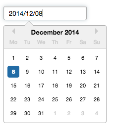

# React Datepicker


This is a simple example of using [`react-datepicker`](https://www.npmjs.com/package/react-datepicker) in a React project.


## Quick examples

```javascript
import React, { useState } from "react";
import DatePicker from "react-datepicker";

import "react-datepicker/dist/react-datepicker.css";

// CSS Modules, react-datepicker-cssmodules.css
// import 'react-datepicker/dist/react-datepicker-cssmodules.css';

const Example = () => {
  const [startDate, setStartDate] = useState(new Date());
  return <DatePicker selected={startDate} onChange={(date) => setStartDate(date)} />;
};
```

```javascript
<DatePicker
  selected={date}
  onSelect={handleDateSelect} //when day is clicked
  onChange={handleDateChange} //only when value has changed
/>
```

```javascript
import { registerLocale, setDefaultLocale } from  "react-datepicker";
import { es } from 'date-fns/locale/es';
registerLocale('es', es)

<DatePicker
  locale="es"
/>
```
